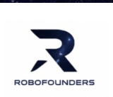

# 🤖 RoboVision — Enterprise AI Computer Vision Suite for Security & Logistics

<p align="center">
  
  <br>
  <b>Powered by RoboFounders.ai</b>
</p>

**RoboVision** is a state-of-the-art computer vision platform built with **Python**, **Streamlit**, and **YOLOv8**. Designed specifically for enterprise security operations and industrial logistics companies, RoboVision transforms CCTV camera feeds into real-time actionable intelligence.

---

## 🌟 Key Application Modules (The 3 Core Solutions)

RoboVision unifies three enterprise AI modules into one interactive, multi-use-case platform:

```
┌────────────────────────────────────────────────────────────────────────────────────────┐
│                                   ROBOVISION SUITE                                     │
├────────────────────────────┬────────────────────────────┬──────────────────────────────┤
│ 🔐 Module 1: Secure        │ 📦 Module 2: Loading       │ 🚛 Module 3: 3D Container    │
│ Product Access Monitoring  │ & Packing Verification     │ Loading & Stacking Optimizer │
└────────────────────────────┴────────────────────────────┴──────────────────────────────┘
```

### 🔐 1. Secure Product Access Monitoring (セキュア製品モニタリング)
* **The Problem:** High-value inventory stored in warehouses or retail spaces is vulnerable to theft or unauthorized removal, lacking automated real-time tracking of who accessed items.
* **The AI Solution:** 
  * Tracks high-value inventory items (e.g., electronics, bottles, luxury goods) frame-by-frame.
  * Spatial slot-based tracking automatically detects when an item is removed from its resting location.
  * Triggers real-time **🚨 BREACH ALARM** visual overlays and logs timestamped access audit events.

### 📦 2. Loading & Packing Verification (積込・梱包検証)
* **The Problem:** Shipping manifests specify target item quantities, but manual eye-counting on fast-moving warehouse conveyor belts is slow, error-prone, and labor-intensive.
* **The AI Solution:**
  * Performs real-time object counting on warehouse conveyor belts.
  * Compares live detected quantities against expected shipping manifest targets.
  * Instantly flags **⚠️ MISMATCH** or confirms **✅ VERIFIED** status, logging inventory discrepancies into SQLite database tables.

### 🚛 3. 3D Container Loading & Stacking Optimizer (3Dコンテナ積載・荷積み最適化)
* **The Problem:** Transporting under-filled shipping containers increases freight costs under strict transport regulations. Workers frequently struggle to determine the optimal stacking order for mixed cargo sizes and weights.
* **The AI Solution:**
  * Analyzes video of incoming cargo on warehouse docks and classifies packages into **Box A (Heavy Base)**, **Box B (Medium Middle)**, and **Box C (Fragile Surface)**.
  * Generates an **AI Loading Plan for Container ❶**: *"Start with Box A [Floor Base] ➔ Stack Box B [Middle] ➔ Top with Box C [Surface]"*.
  * Displays a dynamic **3D Spatial Container Layout Map** and step-by-step worker guidance cards.
  * Computes real-time **Fill Ratio (積載率 94.2%)** and **Weight Balance (50% Front / 50% Rear EVEN)** to ensure axle safety and zero crush risk.

---

## ✨ Features & Capabilities

- 🌐 **Bilingual Localization (English / 日本語):** Instant top-right language toggle switch with professional Japanese logistics industry terminology (積載率, 重畳積載, 偏荷重).
- 🧠 **Real-Time YOLO Inference:** Powered by Ultralytics YOLOv8 for edge-based computer vision on standard video feeds.
- 🎨 **Enterprise Glassmorphic UI:** Modern dark mode design system built with custom CSS tokens (`#0a0f1a` background, HSL accents, responsive metrics cards).
- 🎥 **Multi-Scenario Video Engine:** Toggle between different real-world camera angles (**Scenario 1: Conveyor Parcel Bay** vs **Scenario 2: Heavy Freight Dock**) or upload custom MP4 footage.
- 📊 **Audit Database & CSV Export:** Integrated SQLite database (`robovision.db`) automatically logs events and supports one-click CSV report downloads.

---

## 🛠️ Prerequisites & Installation

### Prerequisites
- **Python 3.10** or higher
- **Git**
- OpenCV dependencies (FFmpeg for video decoding)

### Step 1: Clone the Repository
```bash
git clone https.github.com/JacobAsir/RoboVision.git
cd RoboVision
```

### Step 2: Create & Activate Virtual Environment
```bash
# Windows (PowerShell)
python -m venv venv
.\venv\Scripts\Activate.ps1

# Linux / macOS
python3 -m venv venv
source venv/bin/activate
```

### Step 3: Install Dependencies
```bash
pip install -r requirements.txt
```

---

## 🚀 Running the Application

To launch the RoboVision web interface locally:

```bash
streamlit run main.py
```

After launching, open your browser and navigate to:
```
http://localhost:8501
```

---

## 📂 Project Structure

```
RoboVision/
├── main.py                          # Main Streamlit application & computer vision pipeline
├── requirements.txt                 # Python package dependencies (Streamlit, OpenCV, Ultralytics, etc.)
├── robovision.db                    # SQLite database for real-time audit logs
├── bottle-detection.mp4             # Demo video for Tab 1 (Secure Product Access)
├── 5903898-hd_1920_1080_30fps.mp4   # Demo video for Tab 2 & Tab 3 (Freight Conveyor)
├── container-loading-demo.mp4       # Photorealistic CCTV video for Tab 3 (Container Optimizer)
├── logo-icon.png                    # RoboFounders brand logo
├── rofi-3d.png                      # Rofi 3D mascot asset
└── README.md                        # Documentation
```

---

## 📄 License & Credits

Developed by **RoboFounders.ai** for enterprise security and logistics AI solutions. All rights reserved.
